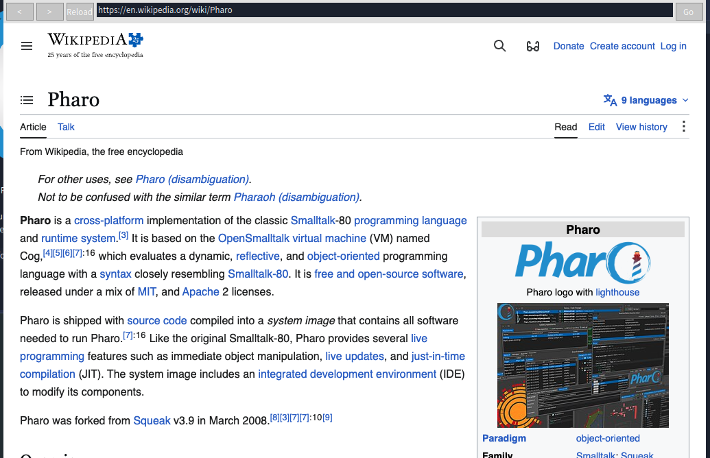
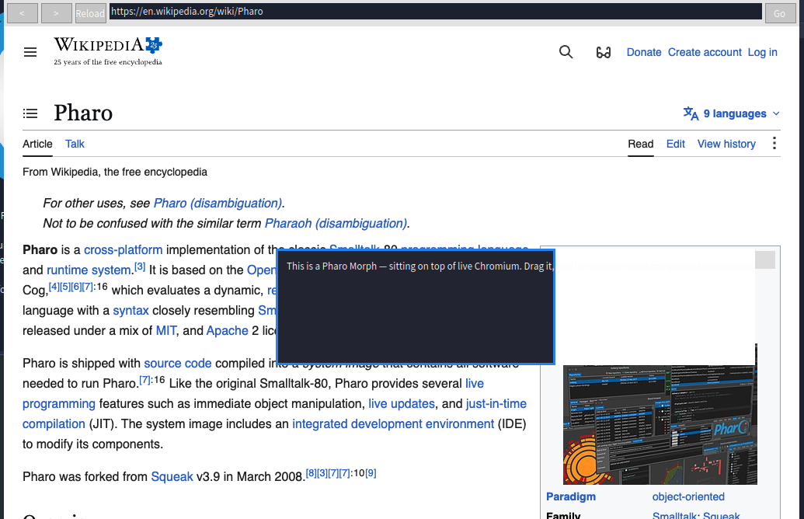
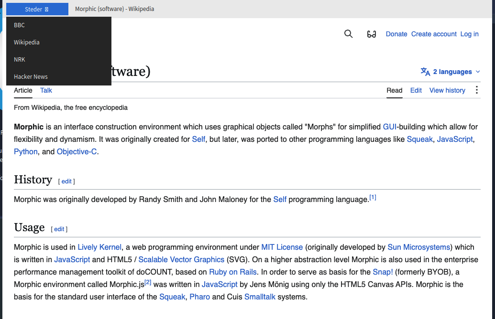
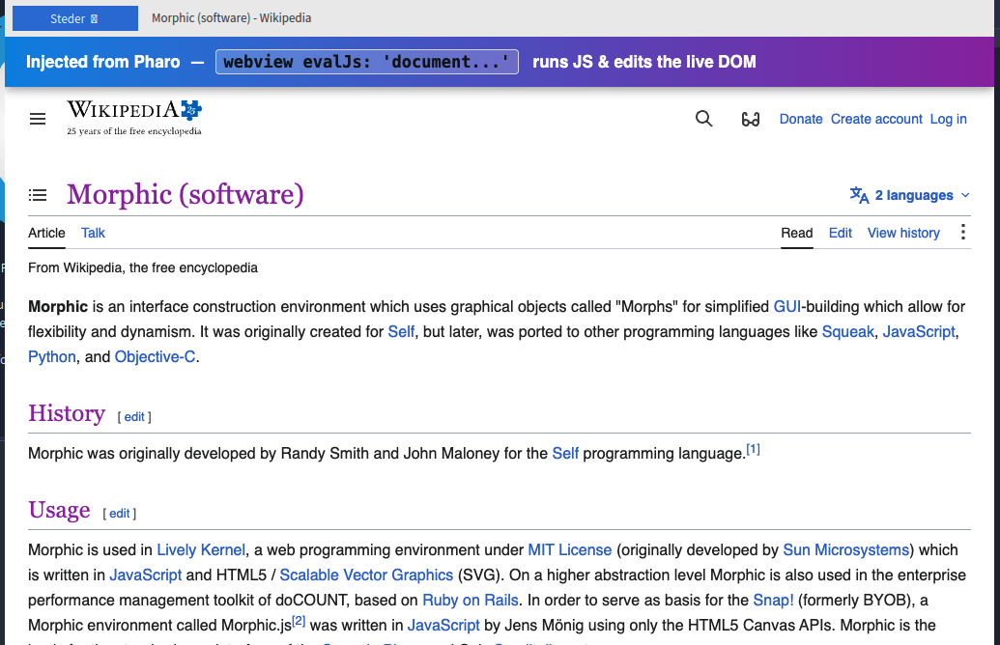
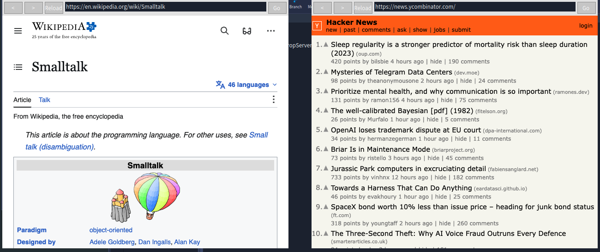

# pharo-webview

**A real web browser — full Chromium, via CEF — running as a first-class Morphic morph inside Pharo.**

Not a screenshot, not an embedded native window bolted on top: the page is
GPU-composited into the Pharo world at the SDL present step from raw BGRA frames
over shared memory (no PNG, no per-frame decode). It behaves like any other
morph — you can drag it, stack morphs over it, put it in a window, script it,
and get callbacks back from the page's JavaScript.



> ⚠️ **Platform: macOS (Apple Silicon / arm64) only, so far.** This is where it
> has been built and tested. The architecture is portable (CEF + SDL + POSIX
> shared memory), but the host app is currently a macOS `.app` bundle with
> macOS-specific launch and code-signing. Linux/Windows are not done yet — help
> welcome.

---

## What you get

- 🌐 **Real Chromium** — modern JS, CSS, video, fonts, HTTPS. It's CEF 138 running
  windowless (offscreen), not a toy renderer.
- 🧩 **A true morph** — lives in the Morphic world, composited every frame. Drag
  it, resize it, embed it in your own widgets.
- 🪟 **Correct z-order** — morphs (menus, panels, halos) can sit **on top of** the
  live page; bring the browser to front and it covers them again.
- ⌨️ **Full input** — mouse click / move / scroll, keyboard, focus, resize, and
  browser navigation (back / forward / reload / address).
- 🔁 **Multiple simultaneous browsers** — each is its own morph and its own
  isolated process; a tabbed multi-view example is included.
- 📜 **Scriptable from Pharo** — run arbitrary JavaScript, manipulate the DOM, and
  get the expression's value back as a Pharo object.
- 📣 **Callbacks from the page** — page-load / title / error events, plus a
  `window.pharo.emit(name, data)` bridge so page JS can push structured data
  straight into your Pharo blocks.

---

## Features in pictures

### Morphs compose over the live browser (z-order)

A plain Pharo `Morph` dropped on top of a live Chromium page. The browser stays
composited underneath, per-frame, respecting the real Morphic stacking order.



### A dropdown menu that overlays the page

`WebViewMenuBrowserMorph` — a browser widget with a "Steder" menu built from
morphs. The dropdown draws over the live page, and the bar shows the page title
live via an `onTitleChange:` callback.



### Run JavaScript & edit the DOM from Pharo

This banner and the recoloured headings were injected into the live page from
Pharo with `webview evalJs: '…'`.



### Many browsers at once

Independent browser morphs, each with its own toolbar and its own `cef_host`
process, running side by side.



---

## Quick start

### 1. Build the CEF host (macOS, arm64)

**Prerequisites:** Xcode command-line tools, `cmake`, `ninja`.

```bash
git clone https://github.com/pegesund/pharo-webview.git
cd pharo-webview
scripts/fetch-cef.sh          # download the pinned CEF 138 distribution (~200 MB)
scripts/build-cef-host.sh     # build + ad-hoc code-sign cef_host.app
```

This produces `cef_host/build/cef_host.app`. Ad-hoc signing is enough for local
use; distributing to other Macs needs Developer ID signing + notarization (see
[`docs/DISTRIBUTION.md`](docs/DISTRIBUTION.md)).

### 2. Load the Pharo packages (Pharo 14)

```smalltalk
Metacello new
	repository: 'github://pegesund/pharo-webview:main/src';
	baseline: 'WebView';
	load.
```

Or, working from a local clone, add it in Iceberg (the source directory is
`src/`) and load the `WebView-*` packages.

### 3. Open a browser

```smalltalk
WebViewFormRenderer install.                 "activate the compositing renderer (once)"

WebViewBrowserMorph new openInWorld.          "a browser widget: toolbar + address bar"
WebViewTabbedBrowserMorph new openInWorld.    "a tabbed, multi-view browser"
WebViewMenuBrowserMorph open.                 "the 'Steder' dropdown-menu demo (z-order)"
```

Each morph launches and kills its own `cef_host` process. Point Pharo at a
specific binary with the `WV_CEF_HOST` environment variable or
`WebViewCefMorph binaryPath:`. It defaults to `cef_host/build/cef_host.app`.

---

## Scripting the page from Pharo

Push JavaScript into the page (an `eval` command → `CefFrame::ExecuteJavaScript`
in the main frame):

```smalltalk
"fire-and-forget — mutate the DOM"
webview evalJs: 'document.body.style.background = "#ffe000"'.
webview evalJs: 'document.querySelector("h1").textContent = "Hei fra Pharo"'.

"expression -> value back in Pharo (delivered on the UI process)"
webview evalJs: '2 + 40'                              then: [ :r | r "=> 42" ].
webview evalJs: 'document.title'                      then: [ :r | r "=> a String" ].
webview evalJs: 'JSON.parse(localStorage.foo || "{}")' then: [ :r | r "=> a Dictionary" ].

"multiple statements: use a function expression that returns"
webview
	evalJs: '(function(){ document.body.insertAdjacentHTML("afterbegin","<h2>hi</h2>");
	                      return document.querySelectorAll("h2").length })()'
	then: [ :n | n "=> the count" ].
```

`evalJs:then:` ships the expression's result back through the `window.pharo`
bridge; JS numbers, strings, booleans, arrays and objects arrive as the matching
Pharo objects (objects → `Dictionary`). JS exceptions are caught and logged.
Commands are JSON-escaped, so the JS may contain quotes, braces and newlines
freely.

## Callbacks from the page

`cef_host` writes a reverse event channel that `WebViewCefMorph` tails and
dispatches to blocks you register. Lifecycle events come from CEF's load/display
handlers; page JavaScript can push its own via `window.pharo.emit(name, data)`
(the bridge is injected into every V8 context before page scripts run).

```smalltalk
webview onPageLoad:    [ :e | Transcript showln: 'loaded ', (e at: 'url') ].
webview onTitleChange: [ :e | Transcript showln: (e at: 'title') ].
webview onLoadError:   [ :e | Transcript showln: 'error ', (e at: 'errorText') ].
webview onJs:          [ :e | (e at: 'data') inspect ].            "any emit()"
webview onJs: 'cart'   do: [ :e | self updateCart: (e at: 'data') ]. "emit('cart', …)"
"generic:  webview onEvent: #loadEnd do: [ :e | … ]"
```

```js
// in the page:
window.pharo.emit('cart', { items: 3, total: 49.9 });   // -> arrives as a Dictionary in Pharo
```

Event kinds: `loadStart`, `loadEnd` (`url`, `httpStatus`), `loadingState`
(`isLoading`, `canGoBack`, `canGoForward`), `loadError`, `title`, and `js`
(`name`, `data`). The block argument is the parsed event `Dictionary`; callbacks
run on the UI process, each wrapped so one failing block can't break stepping.

---

## How it works

```
WebViewCefMorph (Morphic)  ── owns ──►  cef_host.app (separate process)
   │  reads frames                          │  CEF 138 windowless / OSR
   │                                        │  OnPaint → raw BGRA + dirty rects
   ▼                                        ▼
WvSharedMemory (uFFI mmap) ◄── POSIX shared-memory file ──  WvShm writer
   │  ExternalAddress
   ▼
WebViewFormRenderer (OSSDL2FormRenderer subclass)
   composites each browser texture into the world, occlusion-clipped to
   the live Morphic z-order, at the SDL present step
   ▲  input: morph events → input.jsonl → WvControl → CEF Send*Event / navigation
   ▼  events: CEF load/display handlers + window.pharo bridge → <control>.events → callbacks
```

Design decisions, all hard-won:

- **Separate process, not in-process CEF** — macOS bundle / threading / crash
  isolation. The morph owns its `cef_host` and tears it down on close.
- **The CEF command line that actually renders headless on macOS:**
  `--in-process-gpu --disable-gpu-sandbox --single-process --use-mock-keychain
  --password-store=basic`. The missing `--single-process` was the unlock — the
  renderer subprocess never spawned otherwise.
- **Z-order by occlusion-clipping**, not alpha: an ARGB8888 world texture with a
  punched transparent hole rendered fully transparent on this macOS/Metal SDL
  backend, so instead the (known-good, opaque) world texture is drawn first and
  each browser texture is copied on top only into the parts of its bounds not
  covered by morphs in front of it.

## Repository layout

```
src/            Pharo packages (Tonel):
                WebView-Core (morphs + compositing renderer),
                WebView-FFI (WvSharedMemory, WvShim),
                WebView-Example (WebViewBrowserMorph, WebViewTabbedBrowserMorph, WebViewMenuBrowserMorph),
                WebView-Planning, WebView-Core-Tests, BaselineOfWebView
cef_host/       The CEF host app (C++): CefRenderHandler → shared memory, input
                channel, navigation, reverse event channel, JS bridge.
                third_party/cef holds the CEF distribution (fetched, gitignored).
cdp/            A headless-Chrome CDP fallback backend + demo/probe pages.
shim/           Rust cdylib (wvshim): flat C ABI fake engine (an early stepping stone).
scripts/        fetch-cef.sh, build-cef-host.sh, restart-image.sh
docs/           screenshots + DISTRIBUTION.md
```

The full build history and milestone reports also live **in the image** as
`WebViewProjectPlan` (`WebViewProjectPlan planMarkdown`, `… statusString`).

## Status & limitations

Working: live Chromium in a morph; mouse/keyboard/scroll/focus/resize;
navigation; multiple simultaneous browsers; a tabbed browser; morph z-order over
the page; run-JS / DOM manipulation; lifecycle + page-JS callbacks.

Not done yet:

- **macOS/arm64 only** — no Linux/Windows host build, no Intel-mac build.
- Occlusion is rectangular — a morph in front clips the browser by its bounding
  box, so rounded/irregular morphs occlude a slightly larger rectangle.
- IME, and popup / native `<select>` widgets, are not wired up.
- `cef_host.app` is ad-hoc signed (local use); distribution needs Developer ID
  signing + notarization.

## Credits

Built on the [Chromium Embedded Framework](https://bitbucket.org/chromiumembedded/cef)
and [Pharo](https://pharo.org)'s Morphic + OSSDL2 renderer. CEF is distributed
under its own (BSD-style) license; see the CEF distribution for details.
